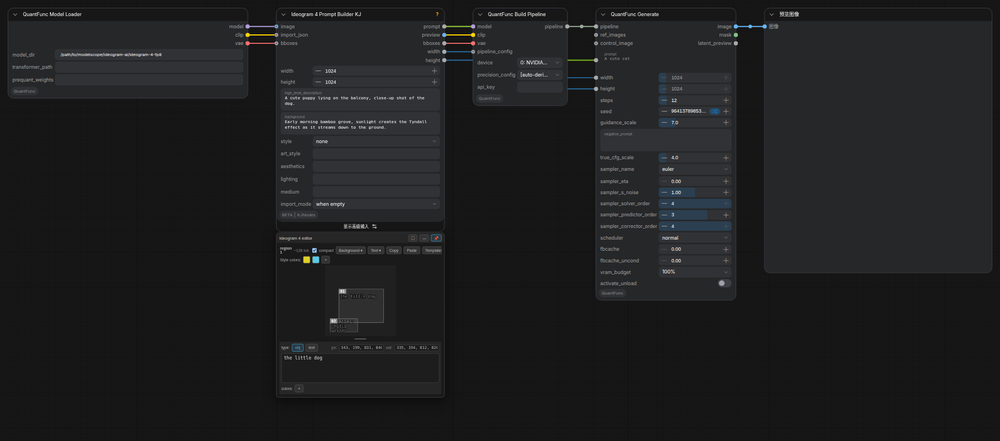

# Ideogram 4 文生图（+ 可选的结构化 / 分区域提示词）

**这篇解决什么场景：** 用 **Ideogram 4** 模型文生图。用**本插件自带节点**就能跑（Generate 直接吃一段文本提示词）；如果想要**结构化 / 分区域（bbox）提示词**，可以再叠一个第三方 **ComfyUI-KJNodes** 的 Prompt Builder 节点（**非本插件自带，需单独安装**，见 §三）。

> **代码核对说明（重要）：** 本文对**本插件自带节点**（`QuantFuncModelLoader` / `QuantFuncBuildPipeline` / `QuantFuncGenerate`）的参数对照插件 `nodes.py`（与仓库 `origin/main` 一致）核对；引擎侧行为（16 倍数、完整 CFG、串行 true-CFG）对照 `Ideogram4Pipeline.cpp` 核对。§三 的 **Ideogram 4 Prompt Builder KJ 是第三方 KJNodes 节点，不在本插件里**（`nodes.py` 无此类、NODE_CLASS_MAPPINGS 未注册；节点右下角有 `BETA | KJNodes` 徽章），其字段以该包为准，本文仅作使用说明。
>
> **完整 workflow 例子：** [`workflow_sample/QuantFunc-Ideogram4.json`](../workflow_sample/QuantFunc-Ideogram4.json)（该样例用到了 KJNodes 的 Prompt Builder）。

---

## 一、整体连线（本插件路径）

只用本插件的三个节点即可出图：

```
[加载 Ideogram-4 模型] → QuantFunc Build Pipeline → QuantFunc Generate → Preview Image
      (Model Loader)                                     ↑ prompt(文本)
```



- **加载**：用 Ideogram-4 系模型（示例是 `ideogram-4-fp8`，`QuantFunc Model Loader` 指目录，见 [模型加载](model-loading-and-apikey_zh.md)）。
- **Generate**：Ideogram 4 是**完整 CFG 模型**（非蒸馏）。示例值 `steps=12`、`guidance_scale=7.0`、`true_cfg_scale=4.0`（对比蒸馏模型的 8 步 / 0 / 1.0）。CFG / 采样细节见 [调度器与采样器](scheduler-and-sampler_zh.md)。
- Ideogram 4 跑**串行 true-CFG**（cond + uncond 两趟），FBCache 提速时负向分支有独立的 `fbcache_uncond` 阈值（见调度器手册 §五）。

> 上图截自样例工作流；样例里 Generate 的 `prompt` 来自 §三 的 KJNodes Prompt Builder。**如果你不装 KJNodes，就直接在 Generate 的 `prompt` 里手写文本**（见下节）。

---

## 二、最简：直接用 Generate 的 `prompt`（无需任何额外节点）

**本插件自带的 `QuantFunc Generate` 的 `prompt` 就是一段普通文本（STRING）**。要跑 Ideogram 4，最简单的做法是：

1. `QuantFunc Model Loader` 指向 Ideogram-4 模型 → `QuantFunc Build Pipeline`；
2. 在 **`QuantFunc Generate` 的 `prompt`** 里直接写你的提示词（可以写多句、包含场景 / 风格 / 各区域描述）；
3. `width`/`height` 用 **16 的倍数**（Ideogram 4 的要求）；`steps≈12`、`guidance_scale≈7.0`、`true_cfg_scale≈4.0`；
4. `image` → Preview / Save。

这一路**完全用本插件节点**，不依赖任何第三方节点。

---

## 三、进阶：结构化 / 分区域提示词（第三方 ComfyUI-KJNodes）

> ⚠️ **这是第三方节点，不是本插件自带的。** `Ideogram 4 Prompt Builder KJ` 由 **ComfyUI-KJNodes** 提供（节点右下角 `BETA | KJNodes` 徽章可证）。**需要你自己从 ComfyUI-Manager 单独安装 ComfyUI-KJNodes**；不装也能用 Ideogram 4（走 §二 的纯文本 `prompt`）。本文只说明它怎么用，字段定义以 KJNodes 包为准。

它把提示词拆成结构化字段 + 一个**可视化分区域编辑器**（节点下方的 “Ideogram 4 editor” 面板），最终拼成一段 Ideogram 4 期望格式的 `prompt` 文本，接到 Generate 的 `prompt`。


**主要字段**（如截图，来自 KJNodes 该节点）：

| 字段 | 类型 | 默认 | 含义 |
|---|---|---|---|
| `width` / `height` | 整数 | `1024` | 画布长宽（也是 bbox 度量的像素网格）。Ideogram 4 需 16 的倍数 |
| `high_level_description` | 多行文本 | 空 | 整图一句话总览（留空则省略） |
| `background` | 多行文本 | 空 | 场景背景描述 |
| `style` | 下拉 | **`none`** | 风格模式（动态下拉）。选某些值会展开对应的子字段（如选 `art_style` 会出现下面的 `art_style` 文本框） |
| `art_style` | 文本 | 空 | `style` 选到 `art_style` 时出现的子字段（填具体艺术风格） |
| `aesthetics` / `lighting` / `medium` | 文本 | 空 | 美学 / 光照 / 媒介描述子（留空则省略） |
| `import_mode` | 下拉 | `when empty` | 接了 `import_json` 时怎么用：`when empty`=仅编辑器为空时做种子（之后编辑器优先，方便你改）/ `always`=总是用导入的 |

- **UI 管理的字段**（`style_palette_data` / `elements_data` / `bg_brightness` / 输出格式等）由**节点底部的 “Ideogram 4 editor” 面板**操作，不用手填：在里面**加区域、画框、写每区文字、调背景亮度、选风格色板**。
- **可选输入**：`image`（编辑器背景参考图）、`import_json`（完整 caption JSON，按 `import_mode` 载入）、`bboxes`（像素空间的框，编辑器没有区域时做种子）。
- **输出**：`prompt`（结构化提示词文本）、`preview`、`bboxes`、`width`、`height` —— 把 `prompt` / `width` / `height` 接到 Generate。

---

## 四、分区域一个具体例子（worked example）

目标：一张 1024×1024 的图，**左半边**画一只猫、**右半边**画一只狗。用 Prompt Builder 的编辑器加两个区域：

1. `width=1024`、`height=1024`；`background` 填“a cozy living room, soft light”。
2. 在 “Ideogram 4 editor” 面板里 **加区域 1**：画一个覆盖左半的框（像素坐标约 `x=0, y=0, width=512, height=1024`），该区文字写 `a fluffy orange cat sitting`。
3. **加区域 2**：画一个覆盖右半的框（约 `x=512, y=0, width=512, height=1024`），文字写 `a happy corgi dog standing`。
4. 编辑器会把这些拼成 `prompt`（`elements_data` 里是各区域的归一化坐标 + 文字），效果类似：

   ```
   background: a cozy living room, soft light
   region [0.00,0.00 - 0.50,1.00]: a fluffy orange cat sitting
   region [0.50,0.00 - 1.00,1.00]: a happy corgi dog standing
   ```
   （实际 JSON 由 KJNodes 编辑器生成，格式以该包为准。）
5. `prompt` / `width` / `height` → Generate；出图后左边是猫、右边是狗，各自落在你画的框里。

> 不想装 KJNodes？同样效果可以在 §二 的纯文本 `prompt` 里用自然语言近似描述（“on the left a fluffy orange cat…, on the right a happy corgi…”），只是没有精确的 bbox 控制。

---

## 五、常见坑 / FAQ

| 现象 | 原因 | 处理 |
|------|------|------|
| 找不到 “Ideogram 4 Prompt Builder KJ” 节点 | 没装第三方 **ComfyUI-KJNodes** | 从 ComfyUI-Manager 装 KJNodes；或不用它，直接在 Generate 的 `prompt` 写文本（§二） |
| 报错 / 尺寸异常 | `width`/`height` 不是 16 的倍数 | 改成 16 的倍数 |
| 输出很糊 / 结构乱 | 当成蒸馏模型跑了（步数 / CFG 太低） | Ideogram 4 是**完整 CFG 模型**：`steps≈12`、`guidance_scale≈7.0`、`true_cfg_scale≈4.0` |
| 分区域没体现 | 编辑器里没加区域，或 `import_mode` 覆盖了编辑 | 在 “Ideogram 4 editor” 面板加区域；`import_json` 只想做种子时用 `when empty` |
| 显存 / 速度 | 完整 CFG 跑两趟 | 提速可试 `fbcache` + `fbcache_uncond`（见调度器手册） |
