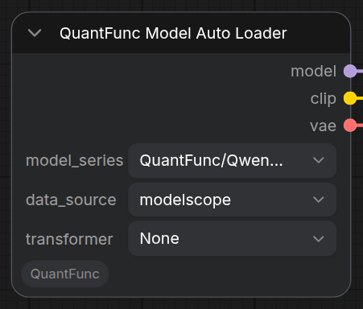
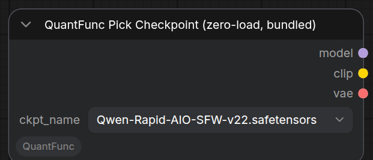
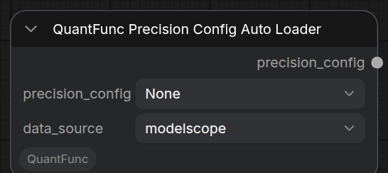

# 模型加载与 API Key

本文讲清楚两件事：

1. **不同场景下有哪些加载模型的方式，它们各自适合谁、怎么连线**；
2. **API Key 是什么、有什么用、去哪里拿、在哪里填**。

> 本文对照插件当前代码（`nodes.py` / `nodes_format_adapters.py` / `model_auto_loader.py`）逐节点、逐参数核对，节点名与参数以你 ComfyUI 里实际看到的、以及 `/object_info` 暴露的定义为准。

---

## 一、加载模型的整体思路（先看这张图）

QuantFunc 的加载**分两步走**，几乎所有工作流都是这个形状：

```
[加载节点：拿到 model / clip / vae]  →  QuantFunc Build Pipeline  →  QuantFunc Generate  →  Preview Image
        (只“指向权重”，零加载)            (真正组装成可运行管线)         (出图)
```

下图是示例工作流里 **`Sample for text to image`** 分组的完整连线，把上面这条链画成了实物——左边三个 `Pick` 加载节点各输出 `MODEL` / `CLIP` / `VAE`，汇入中间的 **Build Pipeline**，再经 **LoRA Auto Loader** 到 **Generate**，最后进 **预览图像**：


三个关键角色：

- **加载节点**只负责“**指向权重文件**”，输出 ComfyUI 原生的 `MODEL` / `CLIP` / `VAE` 三个接口（和官方 UNETLoader / CLIPLoader / VAELoader 同类型），本身**不做真正的 torch 加载**（“零加载”，只记录路径）。
- **QuantFunc Build Pipeline** 才是真正“**组装成可运行管线**”的节点：它接收 `model`/`clip`/`vae`，加上 `device`（选哪张 GPU）、`precision_config`（逐层精度）、可选的 `pipeline_config`（接 **QuantFunc Pipeline Config** 节点覆盖 vae/text 精度、attention 后端、tiled VAE 等高级旋钮；细节见 [工作流参考](workflow-reference_zh.md)）和 `api_key`，输出一个 `QUANTFUNC_PIPELINE`。**权重的真正加载/量化发生在这里**（而不是加载节点里）。
- 之后 **Generate** 拿这个 pipeline 出图。

> 综合示例工作流（同时演示三种加载方式）：
> [`workflow_sample/QuantFunc-Sample-WorkFlow-All-In-One.json`](../workflow_sample/QuantFunc-Sample-WorkFlow-All-In-One.json)

### 在 ComfyUI 里怎么添加这些节点？

如果你是从零搭工作流（而不是导入现成的 `.json`），有两种加节点方式：

- **右键画布 → Add Node → 选分类**：QuantFunc 的节点在两个分类下——
  - **`QuantFunc`**：加载 / 生成 / 导出等主力节点（如 Model Loader、Model Auto Loader、Generate、Export）；
  - **`QuantFunc/v2`**：Build Pipeline 与 Pick 系列（Pick Diffusion Model / Pick CLIP / Pick VAE / Pick Checkpoint / Build Pipeline / Precision Config Loader）。
- **双击画布**：弹出搜索框，直接输入节点显示名（如 `QuantFunc Build Pipeline`）搜索添加。

> 最快的上手方式仍是直接导入 `workflow_sample/` 里的示例 `.json`（连线都接好了），再按需改参数。

---

## 二、三大类加载方式（按你的场景选一种）

| 场景 | 用哪些节点 | 一句话 |
|------|-----------|--------|
| **A. 我没有本地模型 / 想一键下载** | **QuantFunc Model Auto Loader** | 下拉选模型系列，自动判定 GPU 变体并从 ModelScope / HuggingFace 下载，**无需填任何路径**。 |
| **B. 我已有本地模型目录** | **QuantFunc Model Loader** | 指向本地 diffusers 目录（或预量化模型），可选单独指定 transformer / 预量化调制权重。 |
| **C. 我已有拆分好的组件文件 / 单文件全家桶** | **Pick Diffusion Model / Pick CLIP / Pick VAE**（分组件）或 **Pick Checkpoint**（全家桶单文件） | ComfyUI 原生风格的“按文件名挑选”，从 `models/` 下各目录扫描。 |

三种方式的输出都是 `MODEL`/`CLIP`/`VAE`，都接到同一个 **Build Pipeline**，可以按需混用。下面 A / B / C 三小节各配一张对应加载节点的特写图。

---

### A. 一键自动下载 —— QuantFunc Model Auto Loader

最省事的方式，适合新手或没有本地模型的用户。它只有 3 个参数：



| 参数 | 取值 | 默认 | 说明 |
|------|------|------|------|
| `model_series` | `QuantFunc/Qwen-Image-Edit-Series`、`QuantFunc/Qwen-Image-Series`、`QuantFunc/Z-Image-Series`、`QuantFunc/Klein-4B-Series`、`QuantFunc/Klein-9B-Series` | 第一项 | 模型系列。选定后自动去对应仓库拉取该系列的基础模型 + 组件。 |
| `data_source` | `modelscope` / `huggingface` | `modelscope` | 下载源。**国内选 `modelscope`**；海外可选 `huggingface`。 |
| `transformer`（可选） | `None` / 具体权重（`Series/name`） | **`None`** | Transformer 权重变体。`None`（默认）= 用基础模型自带的默认 Transformer。详见下方“关于 transformer 下拉的过滤”。 |

**基础模型的 GPU 变体是自动判定的**（你不用管）：节点内部根据你的 GPU 计算能力（SM）自动选——

- **`50x-above`**：Blackwell（SM120+，如 RTX 50 系）——文本编码器用 **FP4** 基础模型；
- **`50x-below`**：其他所有卡（SM<120，含 RTX 20 / 30 / 40）——文本编码器用 **INT4** 基础模型。

> 首次使用会下载（取决于网速），之后走本地缓存。

#### 关于 `transformer` 下拉的过滤（按“模型系列”，不是按 GPU）

`transformer` 默认是 **`None`** —— 即**用基础模型自带的默认 Transformer**（最省心，也最安全）。取值：

- **`None`（默认）**：不额外挑 transformer，用基础模型自带的那个。它的档位和你的基础模型一致，一定能跑。
- **显式某个权重**（`Series/name.safetensors`）：手动指定某个下载好的 transformer 变体。

**这个下拉会按“模型系列”过滤，但不按 GPU 过滤。** 具体机制在客户端 `web/quantfunc.js` 的 `TransformerFilter`：当你选定 `model_series` 后，下拉里只保留 `None` + **文件名前缀匹配该系列**的 transformer（例如选了 `Klein-9B-Series` 就只看到 `Klein-9B-Series/…` 的权重，看不到 Qwen 系的）——目的是**防止跨系列串选**（选了 Klein 却挑了 Qwen 的 transformer）。服务端列选项的 `get_transformer_options()`（`_build_dropdown()`）**不做任何 GPU / SM 过滤**，只是“系列内所有已知权重”。

> ⚠️ **GPU 档位要靠你自己对齐**：既然下拉**不按 GPU 过滤**，如果你**手动**挑了一个高于你显卡档位的 transformer（例如在 SM120 以下的卡上选了 FP4 / `50x-above` 档），引擎会在推理时 `__trap()` 崩溃（FP4 需要 Blackwell SM120+）。**拿不准就留 `None`**，用基础模型自带的默认 transformer。
>
> 补充：如果你在下拉里**看不到**某个权重，通常是①它不属于你当前选的 `model_series`（被系列过滤挡了），或②catalog / 本地目录里根本没有它——**不是**“被 GPU 过滤隐藏了”（下拉没有 GPU 过滤）。

---

### B. 本地目录加载 —— QuantFunc Model Loader

适合你已经把 diffusers 格式模型下载到本地的情况。三个都是**字符串路径**输入：


| 参数 | 默认 | 说明 |
|------|------|------|
| `model_dir` | 空 | 基础模型目录（内含 `model_index.json`，以及 `transformer/`、`vae/`、`text_encoder/` 等子目录）。 |
| `transformer_path` | 空 | Transformer 权重路径（`.safetensors` 文件或目录）。**留空**则用 `model_dir/transformer/` 下的第一个 `.safetensors`。 |
| `prequant_weights`（可选） | 空 | 预量化**调制权重** `.safetensors` 路径。**仅 Lighting 后端**用；低显存 GPU 推荐。 |

> **什么是 diffusers 格式？** 目录里有 `model_index.json`；其中的组件文件（transformer / text_encoder / vae）由节点在标准 HF 目录布局里自动定位。

---

### C. 组件挑选 / 全家桶 —— Pick 系列（ComfyUI 原生风格）

当你已经有**拆分好的各组件文件**，或一个**单文件全家桶 checkpoint** 时使用。这些节点都是“零加载”——只记录路径，交给 Build Pipeline 真正加载。

| 节点（显示名） | 扫描目录 | 输出 |
|------|----------|------|
| **QuantFunc Pick Diffusion Model (zero-load)** | `models/diffusion_models/`、`models/checkpoints/`、`models/unet/` | `MODEL` |
| **QuantFunc Pick CLIP (zero-load)** | `models/text_encoders/`、`models/clip/`，以及 Model Auto Loader 下载的 `models/QuantFunc/<series>/<base>/text_encoder/`（BF16 官方文本编码器，中文提示词画质更好，以 `[QF]` 前缀标注） | `CLIP` |
| **QuantFunc Pick VAE (zero-load)** | `models/vae/` | `VAE` |
| **QuantFunc Pick Checkpoint (zero-load, bundled)** | `models/checkpoints/` | 一次性输出 `MODEL`/`CLIP`/`VAE`（单文件全家桶，三路同源，按 key 前缀切片） |

下图是全家桶单文件加载节点（一个文件同时给出 model/clip/vae）：



> 你也可以直接用 **ComfyUI 官方**的 UNETLoader / CLIPLoader / VAELoader / CheckpointLoaderSimple 喂给 Build Pipeline——它接收的就是标准 `MODEL`/`CLIP`/`VAE` 接口。Pick 系列的区别是“零加载”，更快、显存占用更小，且只服务 QuantFunc 分支。

---

## 三、支持的模型格式（Build Pipeline 自动检测，你不用选后端）

Build Pipeline 读一次 safetensors 头部（只读 JSON 元数据，不读权重，通常 < 1 MB），**自动判定**用哪个后端加载：

| 检测到的格式 | 依据 | 走的后端 | 含义 |
|------|------|----------|------|
| **原精度 diffusers 基础模型** | 目录有 `model_index.json`，权重是 FP16/BF16 | **Lighting**（运行时量化） | 加载时把 FP16 权重量化为 4bit 加速。**必须配 precision_config**（见下节） |
| **Lighting 预量化模型** | 元数据 `method` 为 `lighting` / `lighting_precomputed` / `flux2klein_runtime`，或权重键含 `._qweight` | **Lighting** | QuantFunc Lighting 导出的预量化权重，加载即用，跳过运行时量化 |
| **SVDQ 预量化模型** | 元数据判定：`model_class` 含 `Nunchaku`，或 `quantization_config.method == svdquant` | **SVDQ** | Nunchaku SVDQ 预量化权重 |
| **全家桶（已量化）单文件 checkpoint** | 单文件里同时含 `model.diffusion_model.` + `text_encoder(s).` + `vae.` 键前缀（≥2 类共存），且带 QuantFunc stamp 的量化元数据 | 自动识别为 bundled checkpoint | 一个文件打包 transformer + 文本编码器 + VAE，自动切片。**自带逐层精度，无需配 precision_config** |
| **全家桶（原精度）单文件 checkpoint** | 同上键前缀，但权重是 FP16/BF16、无量化元数据 | 自动识别为 bundled checkpoint | 同样自动切片；但**精度处理跟原精度 diffusers 一样**——`[auto-derive]` 会自动注入精度表 |

> 当头部无法读取、或格式无法判定时，安全回退到 **Lighting** 后端。若指向的权重文件根本不存在（路径写错、文件没下全），加载会在引擎侧失败并报出**明确的文件路径错误**，而不是静默出错。

---

## 四、precision_config（逐层精度表）—— Build Pipeline 上最重要的旋钮

`precision_config` 是 **Build Pipeline** 上的一个下拉输入，定义 Transformer **每一层**的量化精度，是画质/速度/显存平衡的核心。下图是 Build Pipeline 节点，`precision_config` 和 `device` / `api_key` 都在上面：


它的取值有四类：

| 选项 | 含义 |
|------|------|
| **`[auto-derive]`（默认）** | 对**没有量化元数据的原精度 diffusers 基础模型 / 原精度全家桶 checkpoint**，自动识别模型并**按你选的 GPU** 加载匹配的精度表（Blackwell SM120+ 用 **FP4**，其他用 **INT4**）；SVDQ / 已量化模型（含已 stamp 的全家桶）**保留自身元数据里的逐层配置，不注入**。 |
| **`[none]`** | 从不注入精度表。 |
| **`[builtin] xxx.json`** | 使用插件内置（`<plugin>/configs` 或 `$QUANTFUNC_CONFIGS_DIR`）的固定精度表。 |
| **`[series] yyy.json`** | 使用 QuantFunc 模型系列预设（按需从 ModelScope 下载）。 |

也可以把这个下拉**转成输入接口**，从 **QuantFunc Precision Config Loader (path)** 或 **QuantFunc Precision Config Auto Loader** 用路径喂进来（见第五节）。

> **重点 1：加载“原精度 diffusers 基础模型”或“原精度全家桶 checkpoint”时，精度表几乎是必需的**——默认的 `[auto-derive]` 会替你自动挑一份并注入；如果你改成了 `[none]` 又没有量化元数据，模型会停留在原精度（**很慢、很占显存**）。
>
> **重点 2：`precision_config` 这个下拉也不按 GPU 过滤**（和 `transformer` 一样，服务端 `_build_dropdown` 不做 SM 检查；区别只是 `transformer` 会按模型系列过滤，`precision_config` 连系列都不过滤，把**所有系列、所有档**都列出来，包括 FP4 / `50x-above`）。所以你**手动**选 precision_config 时，**务必选与你 GPU 同档**：在 **SM120 以下**的卡上手动选了 **FP4 / `50x-above` 档**的精度表，会在推理时触发 `__trap()` **崩溃**（FP4 需要 Blackwell SM120+）。**默认 `[auto-derive]` 不会有这个问题**——它按你**在 Build Pipeline 选定的运行 GPU** 自动挑档（SM120+ 用 FP4，否则用 INT4）。
>
> **重点 3：** precision_config **与模型架构绑定**，不同系列不能混用。

---

## 五、组件级自动加载节点（可选，进阶）

除了上面的整体加载，还有一组**只负责下载/定位单个组件、输出字符串路径**的节点，方便你精细拼装：

| 节点 | 输出 | 作用 |
|------|------|------|
| **QuantFunc Base Series Model Auto Loader** | `model_dir` | 从 QuantFunc 系列自动下载基础模型（自动 GPU 变体） |
| **QuantFunc Base Model Auto Loader** | `model_dir` | 从本地 `ComfyUI/models/diffusers/` 里挑一个带 `model_index.json` 的目录 |
| **QuantFunc Base Model Auto Loader with Download** | `model_dir` | 从上游仓库发现并下载基础模型到 `models/diffusers/` |
| **QuantFunc Transformer Auto Loader** | `transformer_path` | 从 `models/QuantFunc/transformer/` 挑 `.safetensors` |
| **QuantFunc Prequant Auto Loader** | `prequant_weights` | 自动下载预量化调制权重 |
| **QuantFunc Precision Config Auto Loader** | `precision_config` | 自动下载逐层精度表，接到 Build Pipeline 的 `precision_config` |

**Precision Config Auto Loader** 有两个参数（`precision_config` 选系列内的哪份表、`data_source` 选下载源）：



> **三个“Base Model”加载器怎么选？**
> - **Base Series Model Auto Loader** —— 你想用 **QuantFunc 官方系列**的基础模型：按系列一键下载，且自动挑对 GPU 变体。**最常用**。
> - **Base Model Auto Loader** —— 你已经把模型放在了 `ComfyUI/models/diffusers/` 下：**不下载**，只从本地下拉里挑一个。
> - **Base Model Auto Loader with Download** —— 你想用**上游（非 QuantFunc 系列）**的任意基础模型：从上游仓库发现并下载到 `models/diffusers/`。

> 这些是可选的“便利件”。最简单的路子仍是 **Model Auto Loader → Build Pipeline**，不需要它们。

---

## 六、API Key —— 作用、获取、填写

### 6.1 API Key 是什么、有什么用

`api_key`（形如 `qf_xxxxxxxx`）是你的**授权/许可密钥**，用于：

- **许可校验**：引擎初始化时向许可服务器（`server_url`，默认 `https://service.quantfunc.com`）校验；
- **解密受保护模型**：加载 QuantFunc 受保护（key-protected）模型时，用它下载并解密该模型的 key map。

### 6.2 免费测试期间：开箱即用，无需配置

> **免费测试期间，所有客户端共享同一个测试 API Key。**

插件已经**内置了这个共享测试 key**，随插件一起分发，位置在紧挨着 `libquantfunc.so` 的配置文件里：

- Linux：`bin/linux/config.json`
- Windows：`bin/windows/config.json`

内容形如：

```json
{
    "server_url": "https://service.quantfunc.com",
    "api_key": "qf_xxxxxxxx...（内置测试 key）"
}
```

所以**在免费测试期间，你什么都不用填、也不用注册**，直接用即可。

### 6.3 正式发布后：到官网注册获取自己的 Key

> **正式发布后，请到我们官网 https://www.quantfunc.com 注册获取你自己的 API Key。**

拿到自己的 key 后，有两种填法（任选其一）：

1. **在节点里填**（推荐）：在 **QuantFunc Build Pipeline** 节点的 `api_key` 输入框里填入你的 `qf_xxx`。**节点里填的值会覆盖 config.json**（`optional` 输入，展开可见，就是上面 Build Pipeline 截图里最下面那个 `api_key` 框）。
2. **改配置文件**：编辑 `bin/<os>/config.json` 里的 `api_key`（以及需要时的 `server_url`）。当 Build Pipeline 的 `api_key` **留空**时，就回退到这个文件里的值。

> 修改 `api_key` **不会**触发管线重建——插件内部对认证凭据做了热更新（`set_api_key`），所以切换 key 不需要重新加载模型。

---

## 七、常见问题（FAQ）

**Q：加载报错 “no transformer .safetensors found”？**
A：Model Loader 在 `model_dir/transformer/` 下找不到权重。确认 `model_dir` 是标准 diffusers 布局（含 `model_index.json` + `transformer/`），或显式填 `transformer_path`。

**Q：原精度 diffusers 基础模型出图很慢、很占显存？**
A：多半是没接精度表。Build Pipeline 的 `precision_config` 保持默认 `[auto-derive]`，或用 Precision Config (Auto) Loader 接一份匹配你模型系列的精度表。

**Q：Model Auto Loader 下拉是空的 / 只有 None？**
A：下拉是联网懒加载的。检查网络与 `data_source`（国内选 `modelscope`），首次会在后台刷新目录；保存的工作流里选过的值即便当前不在列表里也会在执行时解析下载，不会因“Value not in list”而失败。

**Q：需要自己填 API Key 吗？**
A：**免费测试期间不需要**——插件已内置共享测试 key。正式发布后到 https://www.quantfunc.com 注册，把 key 填到 Build Pipeline 的 `api_key` 或 `config.json`。

**Q：`transformer` 和 `precision_config` 下拉是怎么过滤的？会不会替我挡掉跑不了的档？**
A：**两个下拉都不按 GPU 过滤，都不会替你挡掉“比你显卡档位高”的选项。** `transformer` 下拉只按**模型系列**过滤（客户端 `web/quantfunc.js`：选定 `model_series` 后只显示 `None` + 该系列的 transformer，防跨系列串选）；`precision_config` 下拉**连系列都不过滤**（列出所有系列、所有档）。所以**手动**选了高于显卡档位的权重 / 精度表（如在 SM120 以下选 FP4 / `50x-above`）会在推理时 `__trap()` 崩溃。省心做法：`transformer` 留 `None`、`precision_config` 留 `[auto-derive]`——`[auto-derive]` 会按你在 Build Pipeline 选定的运行 GPU 自动挑对档，不会崩。（注意：**基础模型**的 50x-above/50x-below 变体是 Auto Loader 按 GPU 自动挑的，那个不用你管；要你自己对齐档位的只有**手动**选的 transformer / precision_config。）

**Q：50x-below 和 50x-above 是什么？**
A：这是**基础模型 / 权重的 GPU 档位**：`50x-above` = FP4，需 Blackwell（RTX 50 系，SM120+）；`50x-below` = INT4，其余所有卡（RTX 20/30/40）。基础模型由 Auto Loader 按你的 GPU 自动挑，不用你管。
