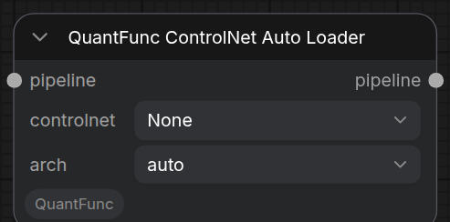
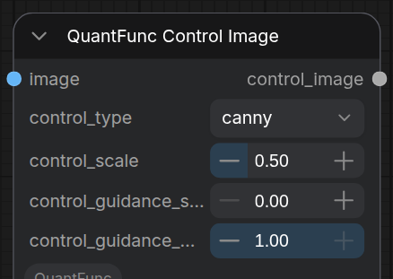
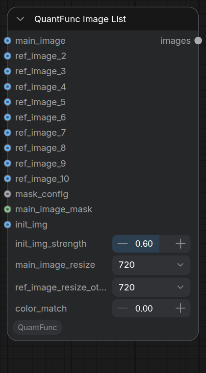
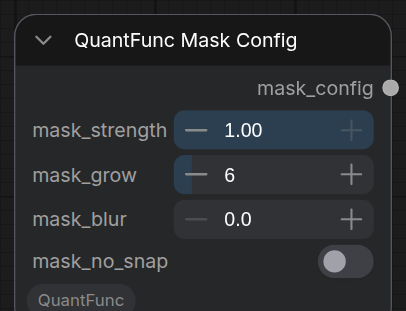
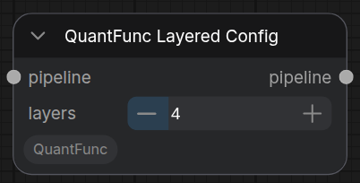
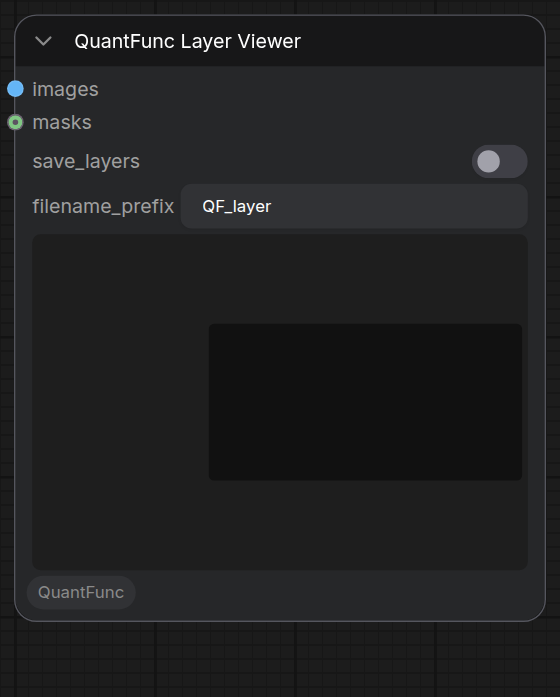
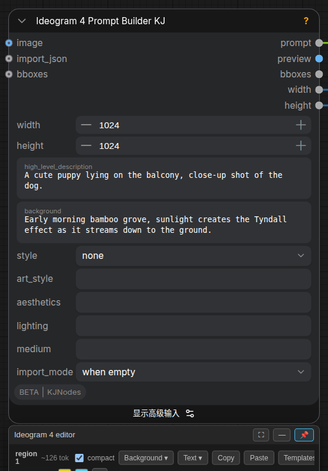

# QuantFunc 节点速查（逐节点参数参考）

**这篇是什么：** 把 QuantFunc 每个节点的 `INPUT_TYPES`（每个参数：类型 / 默认 / 含义）一次列全，当**查阅表**用。**详细用法**见对应专题文档（每节都有链接）。

> 参数值 / 默认一律对插件当前代码（`nodes.py`，与仓库 `origin/main` 一致）核对。只收录 shipping 版真实存在的节点（视频 / Wan 等未发布的开发中节点不在此列）。

---

## 一、加载类（输出 MODEL/CLIP/VAE 或路径）

> 详见 [模型加载与 API Key](model-loading-and-apikey_zh.md)。

### QuantFunc Model Auto Loader
一键下载 + 加载整套模型。→ 输出 `MODEL`/`CLIP`/`VAE`。

| 参数 | 类型 | 默认 | 含义 |
|---|---|---|---|
| `model_series` | 下拉(5) | 首项 | 模型系列（Qwen-Image-Edit / Qwen-Image / Z-Image / Klein-4B / Klein-9B） |
| `data_source` | 下拉 | `modelscope` | 下载源（国内 modelscope / 海外 huggingface） |
| `transformer`(可选) | 下拉 | **`None`** | transformer 变体；`None`=用基础模型自带的。下拉按**模型系列**过滤（非 GPU） |

### QuantFunc Model Loader
指向本地 diffusers 目录。→ `MODEL`/`CLIP`/`VAE`。

| 参数 | 类型 | 默认 | 含义 |
|---|---|---|---|
| `model_dir` | STRING | 空 | 基础模型目录（含 model_index.json） |
| `transformer_path` | STRING | 空 | transformer 权重路径（留空=目录内首个） |
| `prequant_weights`(可选) | STRING | 空 | 预量化调制权重（仅 Lighting 后端） |

### Pick 系列（零加载，按文件名挑）
| 节点 | 输入 | 扫描目录 | 输出 |
|---|---|---|---|
| **Pick Diffusion Model** | `name` | diffusion_models/checkpoints/unet | `MODEL` |
| **Pick CLIP** | `name` | text_encoders/clip（+ QF 下载的 text_encoder，`[QF]` 前缀） | `CLIP` |
| **Pick VAE** | `name` | vae | `VAE` |
| **Pick Checkpoint** | `ckpt_name` | checkpoints | `MODEL`/`CLIP`/`VAE`（全家桶单文件） |

### 组件级自动加载器（输出字符串路径）
| 节点 | 参数 | 输出 |
|---|---|---|
| **Base Series Model Auto Loader** | `model_series`, `data_source` | `model_dir`（按系列下载基础模型，自动 GPU 变体） |
| **Base Model Auto Loader** | `model_dir`(下拉) | `model_dir`（从本地 models/diffusers/ 挑，不下载） |
| **Base Model Auto Loader with Download** | `base_model_repo`, `data_source` | `model_dir`（从上游仓库发现并下载） |
| **Transformer Auto Loader** | `transformer_file`(下拉) | `transformer_path` |
| **Prequant Auto Loader** | `prequant`, `data_source` | `prequant_weights` |
| **Precision Config Auto Loader** | `precision_config`, `data_source` | `precision_config`（逐层精度表路径） |
| **Precision Config Loader (path)** | `path` | `precision_config`（本地绝对路径） |

---

## 二、管线组装

### QuantFunc Build Pipeline
把 `MODEL`/`CLIP`/`VAE` 组装成可运行管线。→ `QUANTFUNC_PIPELINE`。详见 [模型加载](model-loading-and-apikey_zh.md)。

| 参数 | 类型 | 默认 | 含义 |
|---|---|---|---|
| `model`/`clip`/`vae` | 接口 | — | 从加载节点接入 |
| `device` | 下拉 | — | 用哪张 GPU |
| `precision_config` | 下拉 | `[auto-derive]` | 逐层精度表（不按 GPU 过滤，手动选高档会崩） |
| `pipeline_config`(可选) | 接口 | — | 接 Pipeline Config 覆盖高级旋钮 |
| `api_key`(可选) | STRING | 空 | 授权 key（节点值覆盖 config.json） |

### QuantFunc Pipeline Config
高级旋钮，接到 Build Pipeline 的 `pipeline_config`。→ `config`。

| 参数 | 类型 | 默认 | 含义 |
|---|---|---|---|
| `precision` | 下拉 | `bf16` | 计算精度 |
| `text_precision` | 下拉 | `int4` | 文本编码器量化（fp4 需 SM120+，bf16=原精度更准） |
| `vision_quant` | 下拉 | `int8` | 视觉编码器量化（int8=最佳质量/体积平衡） |
| `vae_precision` | 下拉 | `auto` | VAE 精度（auto 在 SM120+ 用 fp8/int8，否则 fp16） |
| `attention_backend` | 下拉 | `auto` | 注意力实现（auto 挑最适合你 GPU 的） |
| `act_quant_mode` | 下拉 | `absmax` | 激活量化尺度算法（Lighting INT4） |
| `tiled_vae` | 布尔 | `False` | VAE 分块解码省显存（高分辨率自动开） |
| `vae_tile_size` | INT | `0` | VAE 分块像素（0=自动） |
| `pinned_memory_limit` | STRING | 空 | 锁页内存上限（如 '60%' / '48G'，空=自动） |

---

## 三、生成

### QuantFunc Generate
核心出图节点。→ `image`/`mask`/`latent_preview`。详见 [基础文生图](basic-t2i-img2img-controlnet_zh.md) + [调度器与采样器](scheduler-and-sampler_zh.md)。

| 参数 | 默认 | 含义 |
|---|---|---|
| `pipeline` | — | 从 Build/LoRA/ControlNet Loader 接入 |
| `prompt` | `A cute cat` | 正向提示词 |
| `width`/`height` | `1024` | 输出尺寸（256–8192，步 64） |
| `steps` | `8` | 步数（1–100） |
| `seed` | `42` | 随机种子 |
| `guidance_scale` | `0.0` | 蒸馏引导（蒸馏=0，base≈3.5） |
| `negative_prompt` | 空 | 负向（配 true_cfg>1） |
| `true_cfg_scale` | `1.0` | 经典 CFG（1.0=关；base≈4.0） |
| `sampler_name` | `euler` | 采样器（22 种，见手册） |
| `scheduler` | `normal` | 调度器（9 种，见手册） |
| `sampler_eta`/`sampler_s_noise` | `0.0`/`1.0` | 随机/祖先采样器用 |
| `sampler_solver_order` | `4` | 仅 lms |
| `sampler_predictor_order`/`sampler_corrector_order` | `3`/`4` | 仅 sa_solver |
| `fbcache`/`fbcache_uncond` | `0.0`/`0.0` | 首块缓存跳步加速（见手册 §五） |
| `vram_budget` | `100%` | 本管线显存上限 |
| `activate_unload` | `False` | 是否允许 ComfyUI 卸载本管线 |

---

## 四、LoRA

> LoRA 权重放 `models/loras/`。

| 节点 | 参数 | 说明 |
|---|---|---|
| **QuantFunc LoRA Auto Loader** | `pipeline`, `lora_file`(下拉), `scale`(默认 1.0, 0–2) | 从 models/loras/ 下拉挑；pipeline 进 / 出 |
| **QuantFunc LoRA Loader** | `pipeline`, `lora_path`(STRING), `scale`(1.0) | 用绝对路径 |
| **QuantFunc LoRA Config** | `pipeline`, `max_rank`(512), `merge_method`(auto) | SVD 合并参数：rank 越高越准越占显存；merge_method（auto/itc/awsvd/rop/concat） |

---

## 五、ControlNet

> 详见 [基础文生图/ControlNet](basic-t2i-img2img-controlnet_zh.md)。仅 QwenImage / ZImage 系有效。

| 节点 | 参数 | 说明 |
|---|---|---|
| **ControlNet Auto Loader** | `pipeline`, `controlnet`(下拉), `arch`(auto) | 从 models/controlnet/ 挑 |
| **ControlNet Loader** | `pipeline`, `controlnet_path`, `arch`(auto) | 用路径 |
| **Control Image** | `image`, `control_type`(canny), `control_scale`(0.5), `control_guidance_start/end`(0.0/1.0) | 控制图 + 强度 |

 

---

## 六、编辑 / 遮罩 / 分层

> 详见 [图像编辑](image-edit-mask-colormatch_zh.md) + [QwenImage-Layered](qwen-image-layered_zh.md)。

| 节点 | 关键参数 | 说明 |
|---|---|---|
| **Image List** | `main_image`/`ref_image_2..10`/`main_image_mask`/`mask_config`/`main_image_resize`(720)/`ref_image_resize_others`(720)/`color_match`(0.0)/`init_img`/`init_img_strength`(0.6) | 编辑中枢 |
| **Mask Config** | `mask_strength`(1.0)/`mask_grow`(6)/`mask_blur`(0.0)/`mask_no_snap`(False) | 遮罩四参数 |
| **Mask Scale By** | `mask`/`scale_by`(1.0)/`method`(bilinear) | 遮罩同比缩放 |
| **Layered Config** | `pipeline`/`layers`(4, 1–16) | 分成 N 张 RGBA 图层 |
| **Layer Viewer** | `images`/`masks`/`save_layers`(False)/`filename_prefix`(QF_layer) | 预览/导出各层 |

 
 

---

## 七、Ideogram 4

> 详见 [Ideogram 4](ideogram4_zh.md)。

**Ideogram 4 Prompt Builder KJ** → 输出 `prompt`/`preview`/`bboxes`/`width`/`height`。关键参数：`width`/`height`(1024, 16 倍数)、`background`(必填)、`high_level_description`、`style`/`aesthetics`/`lighting`/`medium`、`import_mode`(when empty)、`bboxes`（区域编辑器）。

---

## 八、导出 / 预览

### QuantFunc Export
把管线导出为 diffusers 目录或单文件全家桶。详见 [导出量化模型教程](tutorial-2-export-quantized-models_zh.md)。

| 参数 | 默认 | 含义 |
|---|---|---|
| `pipeline` | — | 要导出的管线 |
| `export_path` | 空 | 输出目录 |
| `export_format` | `diffusers` | `diffusers`(每组件独立文件) / `comfy_checkpoint`(单文件全家桶) |
| `export_mode` | `all` | (仅 diffusers) all=整模型 / custom=选组件 |
| `export_transformer` | `True` | 导出 transformer |
| `export_text_encoder` | `False` | 导出文本编码器 |
| `export_vision_encoder` | `False` | 导出视觉编码器 |

### QuantFunc Latent Preview
接 Generate 的 `latent_preview`，在采样过程中预览潜空间。参数 `latent_preview`（接口）。
