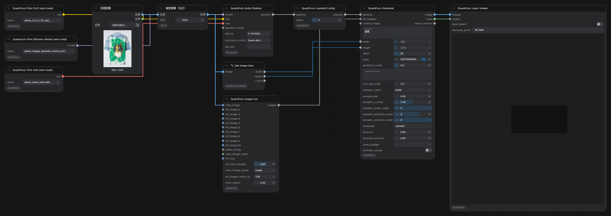

# QwenImage-Layered：把图分解成多张 RGBA 透明图层

**这篇解决什么场景：** 用 **Qwen-Image-Layered** 模型把一张图（或按提示词生成的图）**分解成 N 张带透明通道（RGBA）的图层**，每层是可单独取用的透明 PNG —— 适合做贴纸 / 前景背景分离 / 可编辑素材。

> 本文对照插件当前代码（`nodes.py` 的 `QuantFuncLayeredConfig` / `QuantFuncLayerViewer`，与仓库 `origin/main` 一致）核对。
> **完整 workflow 例子：** [`workflow_sample/QuantFunc-QwenImage-Layered.json`](../workflow_sample/QuantFunc-QwenImage-Layered.json)

---

## 一、整体连线

比普通编辑多两个专属节点：**QuantFunc Layered Config**（设分几层）和 **QuantFunc Layer Viewer**（看 / 存各层）。

```
[加载 Qwen-Image-Layered 模型] → Build Pipeline → QuantFunc Layered Config → QuantFunc Generate ┐
                                                     (设 layers = N)                              │ image → Layer Viewer.images
Load Image → (可选缩放) → QuantFunc Image List ────────────────────────────→ Generate.ref_images │ mask  → Layer Viewer.masks
                                                                                                  ┘
```



- **加载**：用 Qwen-Image-Layered 系模型（Pick Diffusion Model / Model Loader 均可，见 [模型加载](model-loading-and-apikey_zh.md)）。
- **Image List**：接主图 `main_image`（分层通常配合原图，`main_image_resize` 建议 `origin` 做像素对齐；见 [图像编辑](image-edit-mask-colormatch_zh.md)）。
- **Generate**：输出 `image`（N 层堆叠的图像）和 `mask`（N 层各自的 alpha）。
- **Layer Viewer**：把 `image` + `mask` 接进来，预览 / 导出各层。

---

## 二、QuantFunc Layered Config —— 设定分几层


| 参数 | 类型 | 默认 | 取值 | 含义 |
|------|------|------|------|------|
| `pipeline` | QUANTFUNC_PIPELINE | — | — | 从 Build Pipeline 接入；本节点把“分层”配置注入管线后再输出 `pipeline` 给 Generate |
| `layers` | INT | `4` | `1`–`16`（官方默认 4，支持 3 / 4 / 8…） | **分解成几张 RGBA 图层**。**越大分解越细、越慢**。常用 4 |

> 连线顺序：**Build Pipeline → Layered Config → Generate**（Layered Config 夹在中间，`pipeline` 进、`pipeline` 出）。不接 Layered Config 就是普通生成，不分层。

---

## 三、QuantFunc Layer Viewer —— 预览 / 导出各层

把 Generate 的 `image` 和 `mask` 接进来，即可在节点上预览分层结果，并可选导出。


| 参数 | 类型 | 默认 | 含义 |
|------|------|------|------|
| `images` | IMAGE | — | 接 **Generate 的 `image`** 输出（N 层堆叠图像） |
| `masks`（可选） | MASK | 无 | 接 **Generate 的 `mask`** 输出（每层 alpha）。连上才能得到带透明通道的分层 |
| `save_layers`（可选） | BOOLEAN | `False` | 开启 = 额外把 **N 张 RGBA 图层 + 合成图**写到 `output/` 目录 |
| `filename_prefix`（可选） | STRING | `QF_layer` | 导出文件名前缀 |

> 想拿到**可直接使用的透明 PNG 图层**：把 Generate 的 `mask` 接到 Layer Viewer 的 `masks`，并把 `save_layers` 打开 —— 导出的每层就是带 alpha 的 RGBA 图。

---

## 四、采样 / 步数 / CFG

分层生成走 **串行 true-CFG**（cond + uncond 两趟），所以：

- 采样器 / 调度器 / CFG 各参数含义见 [调度器与采样器手册](scheduler-and-sampler_zh.md)。
- FBCache 提速时，分层模型的**负向分支有独立阈值 `fbcache_uncond`**（详见该手册 §五）。
- 具体 `steps` / `guidance_scale` 按你用的是蒸馏还是 base 变体调（见 [基础文生图](basic-t2i-img2img-controlnet_zh.md) 的 steps/guidance 建议）。

---

## 五、常见坑 / FAQ

| 现象 | 原因 | 处理 |
|------|------|------|
| 输出只有一张图、没有分层 | 没接 **Layered Config**，或 `layers=1` | Build Pipeline 后接 Layered Config，`layers` 设 ≥3 |
| 导出的层**没有透明通道** | Layer Viewer 的 `masks` 没连 | 把 Generate 的 `mask` 接到 Layer Viewer 的 `masks` |
| 层数越多**越慢** | `layers` 大 = 分解更细 | 按需降 `layers`（常用 4） |
| 分层与原图**位置对不上** | Image List `main_image_resize` 不是 `origin` | 主图用 `origin` 做像素对齐（见图像编辑文档） |
| 用普通 Qwen t2i 模型分层无效 | 非 Layered 模型 | 换 **Qwen-Image-Layered** 系模型 |
