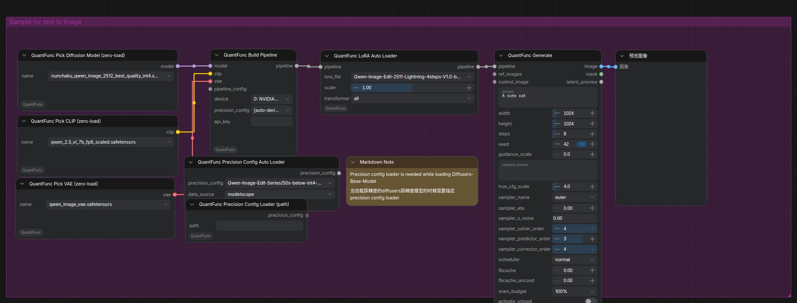
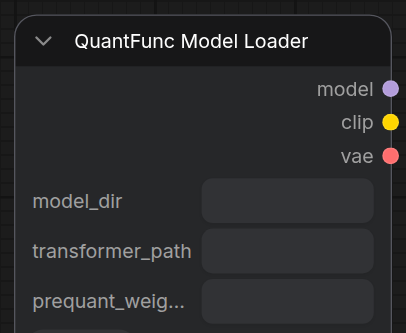
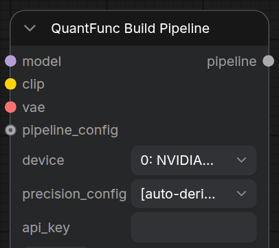
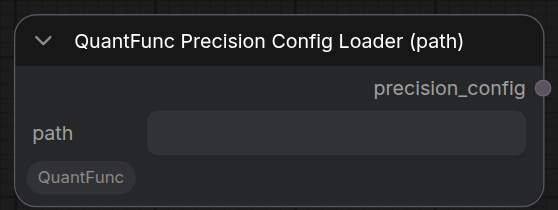
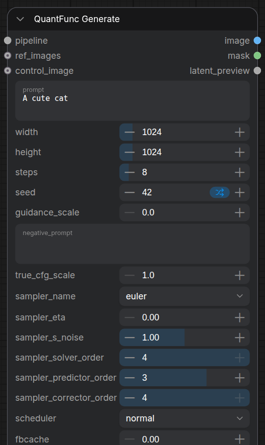
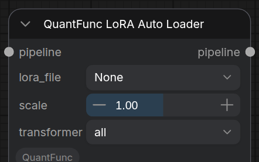
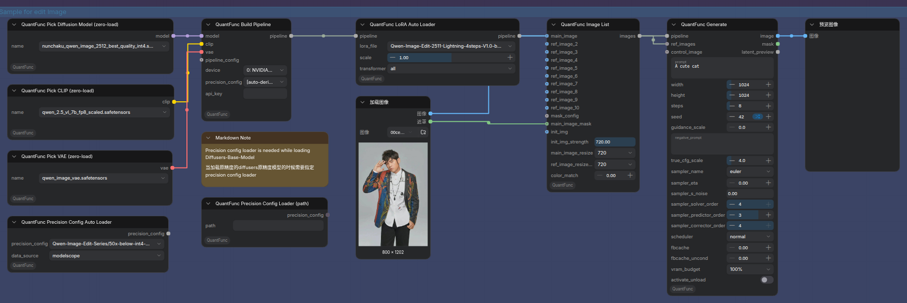

# Tutorial 1: Runtime Quantization — Quantize a BF16/FP16 Model to 4bit at Load Time

[中文版本](tutorial-1-use-without-quantfunc-models_zh.md)

## Overview

You **don't** need to download QuantFunc pre-quantized models to use this plugin. The **Lighting backend** provides **runtime quantization** — it quantizes any **diffusers-format** FP16 model (e.g. [Qwen/Qwen-Image-Edit-2511](https://huggingface.co/Qwen/Qwen-Image-Edit-2511)) at load time and accelerates inference, with no pre-conversion. The backend (lighting / svdq) is **auto-detected** by the engine from the weight metadata — no manual selection.



> **Sample workflow:** [`workflow_sample/QuantFunc-Sample-WorkFlow-All-In-One.json`](../workflow_sample/QuantFunc-Sample-WorkFlow-All-In-One.json)
> — use the "Sample for text to image" group for t2i, or "Sample for edit Image" for editing. Per-parameter illustrated details for the loader / Build Pipeline / Generate nodes are in [Model Loading & API Key](model-loading-and-apikey_zh.md) and [Basic t2i / img2img / ControlNet](basic-t2i-img2img-controlnet_zh.md) (Chinese).

## Prerequisites

1. ComfyUI-QuantFunc plugin installed (see [README.md](../README.md))
2. CUDA 13.0+ runtime and cuDNN 9.x
3. Download a diffusers-format model locally, e.g.:

```bash
# with huggingface-cli
huggingface-cli download Qwen/Qwen-Image-Edit-2511 --local-dir /path/to/Qwen-Image-Edit-2511

# or with git lfs
git lfs install
git clone https://huggingface.co/Qwen/Qwen-Image-Edit-2511 /path/to/Qwen-Image-Edit-2511
```

> **What is diffusers format?** The directory should contain `model_index.json` plus subdirs like `transformer/`, `vae/`, `tokenizer/`.

## Steps

### Step 1: Import the Workflow

Import `workflow_sample/QuantFunc-Sample-WorkFlow-All-In-One.json` in ComfyUI and use the "Sample for text to image" group. The chain is:

```
QuantFunc Model Loader → QuantFunc Build Pipeline → QuantFunc Generate → Preview Image
```

> Loader nodes only "point at weight files" and output ComfyUI-native `model`/`clip`/`vae`; **QuantFunc Build Pipeline** is what assembles and loads/quantizes the pipeline (it carries `device`, `precision_config`, etc.).

### Step 2: Configure Model Loader (point at the FP16 model)

In the **QuantFunc Model Loader** node:

| Parameter | Setting |
|-----------|---------|
| `model_dir` | Your base model directory, e.g. `/path/to/Qwen-Image-Edit-2511` (contains `model_index.json`) |
| `transformer_path` | **Leave empty** — Lighting runtime-quantizes from the FP16 weights in `model_dir` |
| `prequant_weights` (optional) | Pre-quantized modulation weights path, recommended for low-VRAM GPUs (see below) |



> Model Loader **no longer has** `model_backend` / `device` / `precision_config` / `fused_mod`: the backend is auto-detected; `device` and `precision_config` moved to **Build Pipeline**; modulation fusion is enabled automatically by the engine per model.

### Step 3: Configure Build Pipeline (device + precision_config)

Wire the Model Loader's `model`/`clip`/`vae` into **QuantFunc Build Pipeline**:

| Parameter | Setting |
|-----------|---------|
| `device` | GPU index (usually `0`) |
| `precision_config` | Per-layer precision: default `[auto-derive]` (engine derives it from the model); or pick an official preset, or wire a **QuantFunc Precision Config** node with a JSON (see below) |
| `pipeline_config` (optional) | Wire a **QuantFunc Pipeline Config** node to override attention backend / VAE precision / tiled VAE and other advanced knobs |
| `api_key` (optional) | Required by some protected models |



#### About precision_config (per-layer precision)

`precision_config` defines the quantization precision of each transformer layer (INT4 / INT8 / FP8 …), balancing **speed vs quality**. The default `[auto-derive]` lets the engine derive it automatically; to use an officially tuned config, QuantFunc provides recommended configs per series:

> Example download (Qwen-Image-Edit series):
> https://www.modelscope.cn/models/QuantFunc/Qwen-Image-Edit-Series/file/view/master/precision-config

```bash
# example: download the Qwen-Image-Edit precision config
modelscope download --model QuantFunc/Qwen-Image-Edit-Series --include "precision-config/*" --local_dir /path/to/configs
```

For other series, find the `precision-config` folder under the matching repo on the [QuantFunc ModelScope homepage](https://www.modelscope.cn/models/QuantFunc). Then point a **QuantFunc Precision Config Loader (path)** node at the JSON and wire it into Build Pipeline's `precision_config`, or select from the **Precision Config Auto Loader** dropdown.



> **Note:** precision_config is tied to the model architecture — configs from different series **cannot be mixed**.

#### Low-VRAM optimization: prequant_weights (QwenImage series only)

On low-VRAM machines the QwenImage series can use **pre-quantized modulation weights** instead of runtime modulation fusion:

| Your VRAM | Recommendation | Notes |
|-----------|----------------|-------|
| **24 GB+** (RTX 4090 etc.) | leave `prequant_weights` empty | engine auto-fuses modulation, better quality, model ~14 GB |
| **8–12 GB** (RTX 3060 etc.) | set `prequant_weights = path` | model ~11 GB, ~9 s inference (vs 20 s+ without) |

Download the model's `mod_weights.safetensors` from [QuantFunc ModelScope](https://www.modelscope.cn/models/QuantFunc) and put its path in Model Loader's `prequant_weights`.

### Step 4: Configure Generation Parameters

In the **QuantFunc Generate** node:

| Parameter | Suggested Value |
|-----------|-----------------|
| `prompt` | Your text prompt |
| `width` / `height` | `1024` x `1024` (or a size the model supports) |
| `steps` | `20` (full model), `4` (Lightning distilled) |
| `guidance_scale` | `3.5` (distilled models use `0`–`1`) |
| `seed` | Any number |



> Every Generate sampling parameter (22 samplers, 9 schedulers, CFG, FBCache) is covered in the [Scheduler & Sampler Handbook](scheduler-and-sampler_zh.md) (Chinese).

### Step 5: Run

Click **Queue Prompt**. On first run Lighting runtime-quantizes the model (a few extra tens of seconds); later runs use the cache. To skip quantization entirely each time, export the result to disk with [Tutorial 2](tutorial-2-export-quantized-models.md).

## Optional: Add LoRA

The Lighting backend supports **zero-cost LoRA stacking**. Insert a **QuantFunc LoRA Auto Loader** (or **QuantFunc LoRA**) node between the pipeline and Generate:

1. Select / enter your LoRA `.safetensors`
2. Adjust `scale` (default `1.0`)
3. You can chain multiple LoRA nodes

> The Lighting backend does **not** need a QuantFunc LoRA Config node (that's for the SVDQ backend — see [Tutorial 3](tutorial-3-download-quantfunc-models.md)).



## Optional: Image Editing Mode

If you're using an image-editing model (e.g. Qwen-Image-Edit-2511), use the "Sample for edit Image" group instead:

1. Load a reference image with a **LoadImage** node
2. Connect it to a **QuantFunc Image List** node
3. Connect Image List to Generate's `ref_images` input
4. Describe the edit in the prompt (e.g. "change the background to a beach")

Once `ref_images` is connected, the node switches to image-editing mode automatically. Mask inpainting / color matching / size alignment are detailed per-parameter in the [Image Editing guide](image-edit-mask-colormatch_zh.md) (Chinese).



## Optional: Advanced Pipeline Config

To tune further, add a **QuantFunc Pipeline Config** node and wire it into Build Pipeline's `pipeline_config`:

| Parameter | Description |
|-----------|-------------|
| `tiled_vae` | Enable for high-resolution images (also auto-enabled at high res) |
| `attention_backend` | Usually keep `auto` (auto/sage/flash/sdpa) |
| `precision` | Compute precision `bf16` / `fp16` |
| `text_precision` | Text encoder precision, `int4` saves the most VRAM |
| `vae_precision` / `vision_quant` / `act_quant_mode` | Advanced VAE / vision-encoder / activation-quant options |

> **VRAM/offload strategy is chosen automatically by libquantfunc based on your GPU — there are no `cpu_offload` / `layer_offload` manual switches** (old workflows that still set them are silently ignored). Most of the time you don't need this node.

## FAQ

**Q: First load is slow?**
A: Expected. Lighting runtime-quantizes on the first run; later runs use the cached quantized model. You can also export the runtime-quantized models to disk with [Tutorial 2](tutorial-2-export-quantized-models.md) to skip quantization entirely afterward.

**Q: Which models work?**
A: Any diffusers-format model. See the [QuantFunc docs](https://www.modelscope.cn/models/QuantFunc) for currently supported architectures.

**Q: How does this compare to downloading pre-quantized models?**
A: Pre-exported quantized models (including SVDQ) load faster because they skip runtime quantization. Inference speed is roughly the same for SVDQ and Lighting; on sub-RTX-50 machines Lighting has no SVDQ low-rank compute overhead and can be ~20% faster. See [Tutorial 3](tutorial-3-download-quantfunc-models.md).
