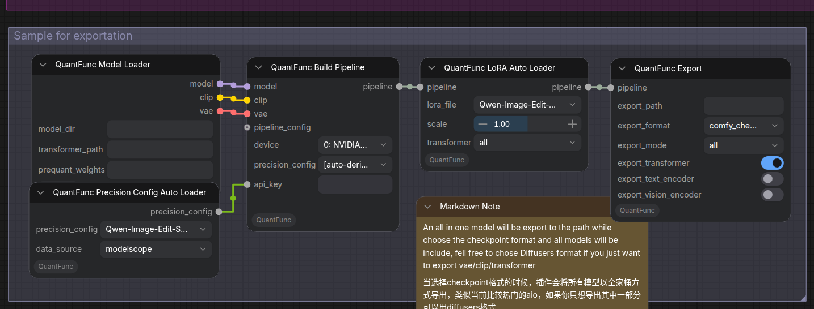
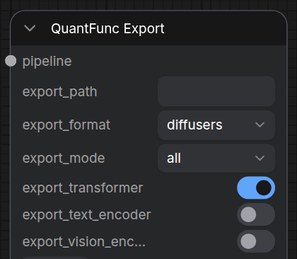

# Tutorial 2: Export Runtime-Quantized Models (with LoRA Fusion Support)

[中文版本](tutorial-2-export-quantized-models_zh.md)

## Overview

The Lighting backend performs **runtime quantization** every time a model is loaded. The **export** function saves all runtime-quantized models to disk, so subsequent loads skip re-quantization entirely. If you've also stacked LoRAs, they are permanently fused into the exported weights. Exported models:

- **All runtime-quantized models saved**: Skips runtime quantization on future loads — instant startup
- **LoRA fused in** (optional): Export can permanently fuse LoRAs into the model — no need to reload them each run
- **Shareable**: Exported models can be shared with others



> **Sample workflow:** [`workflow_sample/QuantFunc-Sample-WorkFlow-All-In-One.json`](../workflow_sample/QuantFunc-Sample-WorkFlow-All-In-One.json) — use the "Sample for exportation" group. The chain:
>
> ```
> Model Loader → Build Pipeline → (optional LoRA) → QuantFunc Export
> ```
> The Export node takes the `pipeline` output of **Build Pipeline**, not the Model Loader directly.

## Use Cases

| Scenario | Description |
|----------|-------------|
| Skip runtime quantization | Export Lighting's runtime-quantized model so startup doesn't re-quantize each time |
| LoRA fusion | Permanently fuse your tuned LoRA (with its strength) into the model |
| Model distribution | Package a configured model to share with teammates |
| Multi-LoRA merge | Merge several LoRAs into a single model to simplify workflows |

## Step 1: Import the Export Workflow

Import `workflow_sample/QuantFunc-Sample-WorkFlow-All-In-One.json` in ComfyUI and use the "Sample for exportation" group.

## Step 2: Configure Model Loader + Build Pipeline

The backend (lighting / svdq) is **auto-detected** by the engine from the weight metadata — there is no `model_backend` parameter on Model Loader; you simply **point at different weights**:

### Option A: Export a Lighting runtime-quantized model (point at the FP16 model)

Once you're happy with Lighting's runtime quantization, export it to disk. Future loads read the exported quantized weights directly, skipping runtime quantization — **loads are usually 2x+ faster**.

Model Loader config (same as in [Model Loading & API Key](model-loading-and-apikey_zh.md) (Chinese), the local-directory loading section):

| Parameter | Setting |
|-----------|---------|
| `model_dir` | Your FP16 base model directory, e.g. `/path/to/Qwen-Image-Edit-2511` |
| `transformer_path` | **Leave empty** — Lighting runtime-quantizes from the FP16 weights |
| `prequant_weights` (optional) | Pre-quantized modulation weights path, recommended for low-VRAM GPUs |


> `device` and `precision_config` are set on **Build Pipeline** (see [Model Loading & API Key](model-loading-and-apikey_zh.md) (Chinese), the `precision_config` section). The modulation optimization (auto-fuse on high VRAM / `prequant_weights` on low VRAM) is covered there (the Model Loader section); the choice at export time is written into the model metadata and auto-applied on load.

### Option B: Export from an existing SVDQ model

When you already have an SVDQ-quantized model and want to permanently fuse a LoRA into it before exporting:

| Parameter | Setting |
|-----------|---------|
| `model_dir` | QuantFunc model directory, e.g. `/path/to/QuantFunc-Model` |
| `transformer_path` | SVDQ transformer weights, e.g. `/path/to/QuantFunc-Model/transformer/model.safetensors` (legacy nunchaku weights also work) |

The engine **auto-detects svdq** from these weights.

> For SVDQ export with a LoRA, you **must** add a **QuantFunc LoRA Config** node (merge strategy). See [Tutorial 3's LoRA config notes](tutorial-3-download-quantfunc-models.md).

## Step 3: Add LoRA (Optional)

Insert **QuantFunc LoRA Auto Loader** (or **QuantFunc LoRA**) nodes between **Build Pipeline** and **Export**:

```
Build Pipeline → LoRA (scale=0.8) → LoRA (scale=1.2) → Export
```

Each LoRA node:
- Select / enter the LoRA `.safetensors`
- `scale`: LoRA strength (`0.0`–`2.0`, default `1.0`)

> The strength you set here is permanently fused into the exported model. The SVDQ backend additionally needs a **LoRA Config** node.


## Step 4: Configure the Export Node

In the **QuantFunc Export** node:

| Parameter | Description |
|-----------|-------------|
| `export_path` | Output directory, e.g. `/path/to/my-exported-model` |
| `export_format` | `diffusers` (HF-style directory, one safetensors per component, reloadable as `model_dir`) or `comfy_checkpoint` (single-file all-in-one, loadable directly as a ComfyUI checkpoint) |
| `export_mode` | `all` — export the full model (recommended, incl. VAE, tokenizer); `custom` — pick components (diffusers only; comfy_checkpoint forces all) |

When `export_mode = custom`, use these switches to pick components:

| Parameter | Default | Description |
|-----------|---------|-------------|
| `export_transformer` | `True` | Export the transformer (quantized weights + fused LoRA) |
| `export_text_encoder` | `False` | Export the text encoder |
| `export_vision_encoder` | `False` | Export the vision encoder |

> **Recommended: `export_mode = all`** — the exported model is complete and standalone, usable directly as `model_dir`.



## Step 5: Run the Export

Click **Queue Prompt**. The export will:

1. Load the base model
2. Apply all LoRAs (at their configured strength and merge strategy)
3. Run runtime quantization (if Lighting quantizing from FP16)
4. Save all runtime-quantized model weights to the target directory

A `diffusers`-format export produces a directory like:

```
my-exported-model/
├── model_index.json
├── transformer/
│   └── *.safetensors    ← quantized weights (with fused LoRA)
├── vae/
├── tokenizer/
├── text_encoder/
└── scheduler/
```

(A `comfy_checkpoint` export is instead a single all-in-one `model.safetensors`.)

## Step 6: Use the Exported Model

The exported model loads two ways (the backend is auto-detected from the exported weights — no selection needed):

### Option A: As a complete model (recommended, for `all` / diffusers export)

| Parameter | Setting |
|-----------|---------|
| `model_dir` | `/path/to/my-exported-model` |
| `transformer_path` | Empty, or point at the exported transformer weights |

### Option B: Replace only the transformer weights

| Parameter | Setting |
|-----------|---------|
| `model_dir` | Original base model directory |
| `transformer_path` | `/path/to/my-exported-model/transformer/model.safetensors` |

> You **don't** need to re-add the previous LoRA nodes — the LoRA is already fused in. A `comfy_checkpoint` all-in-one loads via the plugin's checkpoint-loader adapter path.

## Complete Example: End to End

Suppose you have:
- Base model: `/models/FLUX.1-dev/`
- Style LoRA: `/loras/anime-style.safetensors` (strength 0.8)
- Detail LoRA: `/loras/detail-enhancer.safetensors` (strength 1.2)

**Export flow:**

```
Model Loader                     Build Pipeline        Export
  model_dir: /models/FLUX.1-dev/    device: 0            export_path: /models/my-anime-flux/
  transformer_path: (empty)         precision_config:    export_format: diffusers
                                      [auto-derive]      export_mode: all
      ↓ model/clip/vae                   ↓ pipeline
  Build Pipeline ───────────────→ LoRA (anime-style, 0.8)
                                       ↓
                                  LoRA (detail-enhancer, 1.2)
                                       ↓
                                  Export
```

**Use the exported model:**

```
Model Loader                     Build Pipeline    Generate
  model_dir: /models/my-anime-flux/  device: 0        prompt: "1girl, anime style..."
  transformer_path: (empty)                           steps: 20
      ↓                                ↓ pipeline          ↓
  Build Pipeline ─────────────────────────────────→ Generate → Preview Image
```

No LoRA nodes needed — load and go!

## FAQ

**Q: Can I stack new LoRAs on an exported model?**
A: SVDQ-exported models can take new LoRAs (with a LoRA Config node). But **Lighting-exported models don't currently support stacking new LoRAs** — to change the LoRA combo, re-export from the original FP16 model.

**Q: How long does export take?**
A: Depends on model size and backend. Lighting export includes runtime quantization (a few minutes); SVDQ export is faster since the weights are already quantized.

**Q: How big is the exported model?**
A: INT4-quantized transformer weights are usually ~1/4 of FP16. The full model size (with VAE, tokenizer) depends on the components.

**Q: When to use `custom` export mode?**
A: When you only want to update the transformer weights (e.g. a new LoRA combo) while VAE/tokenizer stay the same, `custom` with only the transformer saves time and space.
