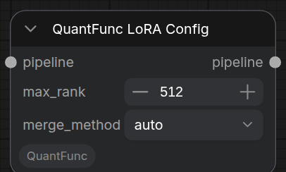

# 教程 3：下载并使用已导出的量化模型

[English Version](tutorial-3-download-quantfunc-models.md)

## 概述

QuantFunc 已将常用模型提前量化并导出，你可以直接下载这些**已导出的量化模型**，加载即用，无需自行进行运行时量化。

这些模型的优势：

- **即时加载**：无需运行时量化，直接加载已导出的权重
- **推理加速**：2x-11x 加速
- **开箱即用**：下载、设置路径、直接使用


> **示例工作流：** [`workflow_sample/QuantFunc-Sample-WorkFlow-All-In-One.json`](../workflow_sample/QuantFunc-Sample-WorkFlow-All-In-One.json) —— 文生图用「Sample for text to image」分组，图像编辑用「Sample for edit Image」分组。

## 第一步：确定你的 GPU 变体

QuantFunc 根据 GPU 架构提供不同版本的量化模型：

| GPU 变体 | 适用显卡 | 说明 |
|----------|----------|------|
| `50x-below` | RTX 20/30/40 系列 | 针对 Turing/Ampere/Ada 优化 |
| `50x-above` | RTX 50 系列 | 针对 Blackwell 优化 |

> **重要：** 基础模型和 Transformer 权重必须使用**相同的 GPU 变体**。（用 Model AutoLoader 自动下载时会自动匹配，见 [模型加载与 API Key](model-loading-and-apikey_zh.md) A 小节。）

## 第二步：下载模型

从以下平台下载预量化模型：

- **ModelScope**: https://www.modelscope.cn/models/QuantFunc
- **HuggingFace**: https://huggingface.co/QuantFunc

QuantFunc 提供两种类型的预导出模型 —— **SVDQ** 和 **Lighting**，均可直接使用。后端类型由引擎从权重元数据**自动识别**，你无需手动选择：

| 模型类型 | 引擎自动识别为 | 说明 |
|----------|--------------|------|
| SVDQ | `svdq` | 离线 SVD 量化；叠加 LoRA 需要 LoRA Config 节点 |
| Lighting | `lighting` | 由运行时量化导出，无 low-rank 计算开销；LoRA 直接叠加 |

每个模型仓库通常包含：

```
QuantFunc/SomeModel/
├── model_index.json          # diffusers 模型索引
├── transformer/              # 预量化的 Transformer 权重
│   └── *.safetensors
├── vae/                      # VAE 权重
├── tokenizer/                # Tokenizer
├── text_encoder/             # 文本编码器
└── scheduler/                # 调度器配置
```

下载示例：

```bash
# 使用 modelscope 下载（国内推荐）
pip install modelscope
modelscope download --model QuantFunc/YourModel-SVDQ --local_dir /path/to/QuantFunc-Model

# 或使用 huggingface-cli
huggingface-cli download QuantFunc/YourModel-SVDQ --local-dir /path/to/QuantFunc-Model
```


## 第三步：导入 Workflow 并配置

在 ComfyUI 中导入 `workflow_sample/QuantFunc-Sample-WorkFlow-All-In-One.json`，使用「Sample for text to image」分组。链路：

```
QuantFunc Model Loader → QuantFunc Build Pipeline → QuantFunc Generate → Preview Image
```

在 **QuantFunc Model Loader** 节点中，指向你下载的模型（SVDQ 或 Lighting 都用同一个 Model Loader，引擎自动识别后端）：

| 参数 | 设置 |
|------|------|
| `model_dir` | QuantFunc 模型目录路径，例如 `/path/to/QuantFunc-Model` |
| `transformer_path` | Transformer 权重路径，例如 `/path/to/QuantFunc-Model/transformer/model.safetensors`（SVDQ 也兼容旧版 nunchaku 权重） |


> Model Loader 上**没有** `model_backend`、`device` 参数：后端自动识别，`device`/`precision_config` 在 **Build Pipeline** 上设置（详见 [模型加载与 API Key](model-loading-and-apikey_zh.md)）。因为模型已量化好，不会发生运行时量化，加载很快。

## 第四步：配置生成参数

在 **QuantFunc Generate** 节点中：

| 参数 | 建议值 |
|------|--------|
| `prompt` | 你的文本提示词 |
| `width` / `height` | `1024` x `1024` |
| `steps` | `20`-`30`（完整模型），`4`（Lightning 蒸馏模型） |
| `guidance_scale` | `3.5`（蒸馏模型用 `0`~`1`） |
| `seed` | 任意数字 |


## 第五步：运行

点击 **Queue Prompt**。预量化模型加载速度快，首次推理也不需要运行时量化。

## 使用 LoRA（SVDQ 后端）

SVDQ 后端使用 LoRA 时，**必须**添加 **QuantFunc LoRA Config** 节点来控制合并策略：

```
Build Pipeline → QuantFunc LoRA (你的 LoRA) → QuantFunc LoRA Config (合并策略) → QuantFunc Generate
```

**QuantFunc LoRA Config** 参数：

| 参数 | 说明 |
|------|------|
| `merge_method` | `auto`（推荐）—— 引擎自动选择最佳方法 |
| | `itc` —— IT+C 方法 |
| | `awsvd` —— Activation-Weighted SVD |
| | `rop` —— Rank-Orthogonal Projection（QuantFunc 创新算法） |
| | `concat` —— 直接拼接（nunchaku 的实现方式） |
| `max_rank` | 最大合并 LoRA 秩（默认即可） |

> 这是因为 SVDQ 模型中已经融合了预量化的低秩结构，新增 LoRA 需要与已有结构合并。Lighting 后端叠加 LoRA **不需要** LoRA Config 节点，直接串接即可。



## 图像编辑模式

改用「Sample for edit Image」分组：

1. 用 **LoadImage** 加载参考图 → **QuantFunc Image List** → Generate 的 `ref_images`
2. 在 prompt 中描述编辑内容

遮罩局部重绘 / 色彩匹配 / 尺寸对齐见 [图像编辑图文指南](image-edit-mask-colormatch_zh.md)。


## SVDQ vs Lighting 对比

| 维度 | SVDQ（离线量化） | Lighting（运行时量化） |
|------|----------------|---------------------|
| 模型来源 | 必须下载 QuantFunc 预量化模型 | 任意 diffusers FP16 模型 |
| 首次加载 | 快（直接加载） | 慢（首次加载需运行时量化；可用[教程 2](tutorial-2-export-quantized-models_zh.md) 导出后加速） |
| 推理速度 | 2x-11x | 2x-11x（RTX 50 以下机器比 SVDQ 快约 20%） |
| 量化质量 | 良好（离线优化） | 良好 |
| LoRA 使用 | 需要 LoRA Config 节点 | 直接叠加，零成本 |
| 灵活性 | 受限于预量化模型 | 任意模型均可 |

> 后端类型两者都由引擎自动识别，你只需指向对应权重。

## 常见问题

**Q: model_dir 和 transformer_path 有什么区别？**
A: `model_dir` 指向完整的 diffusers 模型目录（包含 VAE、tokenizer 等），`transformer_path` 指向具体的量化 Transformer 权重文件（.safetensors）。

**Q: 输出全是噪点？**
A: 请确认 `transformer_path` 指向的是**完整且与该模型匹配**的量化权重，且 `precision_config`（在 Build Pipeline 上）与模型系列一致。后端由引擎自动识别，无需也无法手动指定；不同系列的 precision_config 不能混用。

**Q: 50x-below 和 50x-above 能混用吗？**
A: 不能。必须使用与你 GPU 匹配的变体，否则可能出错或性能下降。
